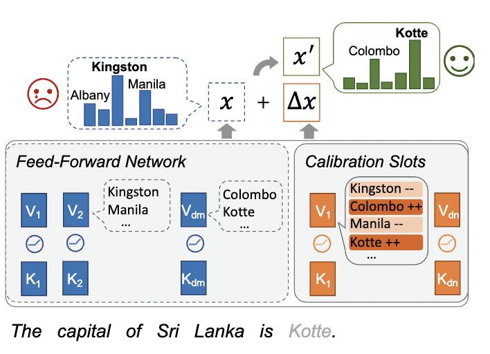

# CaliNet: Calibrating Factual Knowledge in Pretrained Language Models

This project hosts the code for implementing the following paper:

> [**Calibrating Factual Knowledge in Pretrained Language Models**](https://arxiv.org/abs/2210.03329),            
> Qingxiu Dong, Damai Dai, Yifan Song, Jingjing Xu, Zhifang Sui, Lei Li    
> In: Findings of EMNLP, 2022  
> *arXiv preprint ([arXiv 1912.04488](https://arxiv.org/abs/2210.03329))*   


<p align="center"></p>

## Highlights
- **Contrastive Knowledge Assessment:** We detect false knowledge in PLMs with a Contrastive Knowledge Assessing (CKA) method. The key motivation behind CKA is a plain argument that a PLM correctly learns a fact if and only if the model assigns the right fact higher scores than possible negative facts.
- **Calibrating at Scale:** We propose CaliNet by adding a side network parallel to FFNs in the main PLM network. CaliNet calibrates 100 or 1000 facts at once without iterative modifications and manifests great generalization ability.
- **Parameter-efficient:** By fixing the main network and tuning the side network with constructed data, we reduce the false knowledge rate by 31.01%, with only 0.1% extra parameters introduced.
- **Interpretable Working Mechanism:** We investigate how CaliNet works via calibration memory slots.

## Updates
   - CaliNet and CKA is available. Code and data of our paper are released. (17/10/2022)

## Requirements

* Python >= 3.7
* torch >= 1.9.0
* transformers >= 4.13.0.dev0
* datasets


## Installation
This implementation is based on [huggingface transformers](https://github.com/huggingface/transformers) (v4.13.0.dev0). Please refer to [hf.yml](hf.yml) for installation and simply install the conda environment by:

```shell
    conda env create -f hf.yml
```

## Setup

Check out the [ParaRel github repo](https://github.com/yanaiela/pararel).
Download it to the following [folder](train_calinet/dataset/) so that the following folder would exist:
`train_calinet/dataset/pararel` along with the relevant files.
Begin by downloading the our preprocessed dataset for detecting and calibrating from [here](https://drive.google.com/file/d/1lyabuSg_V5abDDUgBeyiL5TATao4rXws/view?usp=sharing), save them to
`train_calinet/dataset/pararel`. And please download the trex dataset from [here](https://dl.fbaipublicfiles.com/LAMA/data.zip).

Set the environment path:
```bash
export PROJECT_PATH=you_project_path
export OUTPUT_PATH=you_output_path
```

## Usage

### Contrastive Knowledge Assessment

For a simple implementation of contrastive knowledge assessment, we provide three negative relation templates for each relation in [LAMA](https://github.com/facebookresearch/LAMA) positive relation template is the original prompt in LAMA).
Refer to: `cka/relations.jsonl` for the templates. To generate data for knowlege assessment, we randomly sample 500 facts for each relation and preprocess them to paraphrased sentences via ParaRel, and save the probing data to `cka/probing_data_trex_500each.json`

We can generate probing data by:
```bash
python cka/preprocess_assess.py
```
For the CKA of 10~5000 human-annotated facts (relation replacement), run evaluation by:
```bash
python cka/assessing_score.py
```
For the CKA of 50 human-annotated facts (object replacement rather than relation replacement), run evaluation by:
```bash
python cka/assessing_score_for_manual.py
```

### Prepare Knowledge-intensive Training Data for CaliNet
```bash
cd train_calinet
python dataset/pararel_code/preprocess_for_t5_2json.py
python dataset/pararel_code/preprocess_for_t5_json2csv.py
```
### Train CaliNet
* **layers** refers to a set of layers to add CaliNet to.
* **dim** refers to the dimension of CaliNet.
* **fact_nums** refers to the num of facts to calibrate.

```bash
cd train_calinet
bash bash/t5_train_kb_f.sh
```

### CaliNet on ODQA
```bash
cd qa_finetune
```
Run fine-tuning for the vanilla model:
```bash
bash bash/run_cbqa.sh
```

Generating data to be calibrated for the model: refer to [gen_process.md](gen_process.md).


Run fine-tuning for the calibrated model
```bash
bash bash/run_cbqa_ffn.sh
```
### Meaning of FFN values & Worknig Mechanism of CaliNet
We mainly follow the implementation of the [Transformer Feed-Forward Layers Build Predictions by Promoting Concepts in the Vocabulary Space](https://github.com/aviclu/ffn-values).


## Contributing to the project
Any pull requests or issues are welcome.


## Citations
Please consider citing our papers in your publications if the project helps your research. BibTeX reference is as follows.
```
@article{dong2022calibrating,
  title={Calibrating Factual Knowledge in Pretrained Language Models},
  author={Dong, Qingxiu and Dai, Damai and Song, Yifan and Xu, Jingjing and Sui, Zhifang and Li, Lei},
  journal={Findings of Empirical Methods in Natural Language Processing (EMNLP)},
  year={2022}
}
```
